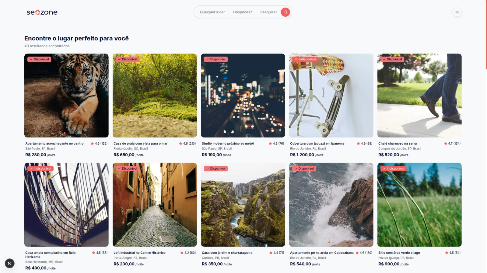

<div>  
  
</div>

<h1>Seazone Reservas</h1>

<p>O objetivo deste teste é simular parte da interface de um portal de busca e reserva de imóveis, similar a um mini-Airbnb.</p>

<h2 id="tech-stack">Principais Ferramentas e Tecnologias Utilizadas 💻</h2>

[](https://skillicons.dev)

<h2 id="tech-stack">Principais Ferramentas e Tecnologias Utilizadas 💻</h2>

- Tailwind CSS: Optei pela agilidade e modularidade que ele proporciona.

- pnpm: Escolhi o pnpm pela performance e velocidade em gerenciar os pacotes da aplicação.
- Shadcn/ui: Escolhi devido à acessibilidade dos componentes e a filosofia de copiar e colar os componentes diretamente no código, dando controle para customizá-los.
- Axios: É um cliente HTTP muito simples de utilizar e eu considero uma abstração mais confortável do que o fetch padrão.
- Swiper: Biblioteca simples criação de sliders e carrosséis modernos e responsivos.
- React Hook Form & Zod: Utilizados para gerenciamento de formulários de forma performática e para a validação robusta de schemas.
- ESLint & Prettier: Ferramentas para padronização e garantia da qualidade do código.
- Postman: Ferramenta indispensável no dia a dia para testar e validar os endpoints da API.
- tweakcn.com: Uma plataforma que descobri e que facilitou muito a customização do tema do shadcn/ui para chegar na identidade visual que eu queria.
- motion: Utilizei para criar interações como a expansão e o recolhimento da Navbar.

<h2 id="project-overview">Guia de Instalação e Execução do Projeto🚀 </h2>

### Cloando o repositório

#### 1. Clone o repositório na pasta deseja

```bash
git clone https://github.com/aridanpantoja/seazone-reservas
```

#### 2. Instale as dependências necessárias

```bash
# Com pnpm (Recomendado)
pnpm install

# Ou com yarn
yarn install

# Ou com npm
npm install
```

#### 3. Crie um arquivo `.env.local` na raiz do diretório e adicione as variáveis de ambiente:

```env
BACKEND_API_URL="http://localhost:3001"
```

- Se quiser também pode copiar o arquivo `.env.example`

<h2 id="organizacao">📂 Organização das Pastas do Projeto</h2>

```
├── public/               # 📁 Armazena arquivos estáticos como imagens e ícones
└── src/                  # 📂 Contém todo o código-fonte da aplicação.
    ├── actions/          # ✨ Server Actions para mutações de dados no servidor (ex: criar uma reserva).
    ├── app/              # 🗺️ Estrutura de rotas, páginas e layouts (App Router)
    ├── components/       # 🧩 Componentes reutilizáveis que compõem a UI.
    ├── config/           # ⚙️ Arquivos de configuração globais (ex: instância do Axios, metadados do site).
    ├── constants/        # 🗃️ Dados estáticos e valores constantes (ex: lista de estados brasileiros).
    ├── hooks/            # 🎣 Hooks customizados para encapsular e reutilizar lógicas complexas.
    ├── lib/              # 🛠️ Funções utilitárias, helpers e schemas de validação (Zod).
    ├── providers/        # 📦 Provedores de contexto para gerenciar o estado global da aplicação.
    ├── services/         # 📡 Camada responsável pela comunicação com a API externa.
    └── types/            # 📝 Definições de tipos e interfaces do TypeScript para garantir a tipagem.
```

<h2 id="contribute">Pontos a melhorar 🚀</h2>

- Gostaria de adicionar mais detalhes como a diferenciação entre hospedes adultos e crianças
- Criar a galeria das imagens de cada acomodação semelhante ao do AirBnb com slides e modais
- Melhorar a lógica do `Search Form` para que ele seja mais semelheante às soluções apresentadas na Seazone e AirBnb, em que ele em telas maiores é um formulário e só em telas pequenas se torna um modal que pode ser utilizado para fazer pesquisas
- Adicionar inputs de quantidade de quartos, banheiros e hóspedes mais semelhentes aos presentes na Seazone e AirBnb ondem possuem um botão para diminuir e outro para aumentar as quantidades, facilitando a utilização em dispositivos móveis e telas menores.
- Adicionar um formulário na página `/acomodacoes/[id]` para que o usuário possa ver imediatamente o preço da sua reserva de acordo com os dias de checkin e checkout, facilitando também o compartilhamento das informações com os `Search Params`
- Adicionar paginação na página de busca `/s`
- Adicionar mais animações para navegação mais fluida
- Adicionar máscaras em campos de formulário que utilizam valores específicos como dinheiro

<h2 id="api">⚠️ Observação sobre o Back-end</h2>

- _Limitações e Soluções na API (JSON-SERVER)_: A API mock (baseada em json-server) apresentou instabilidade nos filtros. A utilização de múltiplos parâmetros simultaneamente causava sobreposição e resultados incorretos.
- Como solução temporária para garantir a estabilidade do front-end, alguns filtros mais complexos, como o `_limit` (que limitava os resultados nas seções presentes na home), foram removidos. A lógica de filtragem foi simplificada para garantir o funcionamento essencial do projeto em qualquer ambiente.
